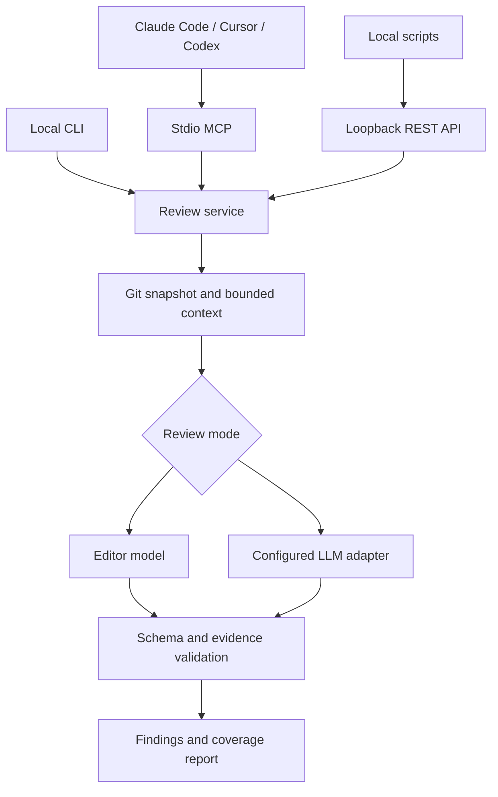

# Architecture and extension guide

> This document records the v0.1 baseline. For current v0.2 capabilities, accounting, integrations, generation, and limitations, see [EXTENSIONS.md](EXTENSIONS.md). The current suite contains 72 tests and four MCP tools.

## Data flow

## Modules

| Module | Responsibility |
| --- | --- |
| `config.py` | Explicit TOML configuration, limits, provider endpoint policy |
| `git_context.py` | Git scope, path filtering, diff collection, hunk maps, snapshot hash |
| `privacy.py` | Default excludes and recognized-secret redaction |
| `prompts.py` | Review task, data boundary, output schema, context export |
| `providers.py` | Ollama, OpenAI Responses, Anthropic Messages, compatible HTTP, demo rules |
| `schema.py` | Strict output fields, severity, exact changed-line/evidence checks |
| `engine.py` | Collect, invoke, validate, compare snapshot, report |
| `service.py` | Shared tool operations; eight in-memory context snapshots |
| `mcp_server.py` | Minimal newline-delimited JSON-RPC stdio MCP tools implementation |
| `http_server.py` | Loopback development REST wrapper with fixed repository |
| `cli.py` | Commands, output, exit status |

## Why this starting design

The core uses Python 3.11+ standard-library modules. It can run without Docker, databases,
package installs, or cloud infrastructure. The MCP implementation is intentionally small:
initialize, initialized notification, ping, tools/list, and tools/call. It negotiates the
2025-06-18 protocol, with 2025-03-26 and 2024-11-05 support for the common tools subset.
It has no server-initiated requests, sampling, resources, prompts, streaming, HTTP MCP, or
in-flight cancellation. Requests are sequential and long model calls may need a larger client timeout.

The optional interoperability script uses the official Python MCP client. If broader MCP
capabilities become necessary, replace the transport with the official SDK and retain the
`ReviewService` interface. For a hosted product, replace the local REST wrapper with FastAPI,
plus authenticated jobs and a real queue. Neither change should alter the review engine.

## Provider contract

`generate(config, snapshot)` returns `(review_object, usage)`.

- Ollama: `POST /api/chat`, JSON schema in `format`, non-streaming output.
- OpenAI: `POST /v1/responses`, strict schema under `text.format`, `store=false`.
- Anthropic: `POST /v1/messages`, forced `submit_review` tool with the review schema.
- Compatible servers: `POST /v1/chat/completions`, JSON mode, followed by local validation.

Model IDs are explicit configuration. A model must support its endpoint's requested output
mode. The project does not pretend every model is interchangeable. HTTP redirects and ambient
proxies are disabled. No automatic retries or cross-provider fallbacks occur, keeping accidental
cost and data routing predictable. Usage comes from provider responses; unavailable counts are null.

## Budgets and snapshot guarantees

The character limit counts serialized included file records, not a tokenizer estimate. The
request also includes the task, schema, and small snapshot metadata. Detailed skipped lists
stay out of the independent LLM prompt. There is one bounded request per review, not automatic
chunking. Start with small changes. Increase limits only after evaluating latency and output quality.

Ollama requests a 16,384-token context window. Character limits cannot prove token fit for every
language/tokenizer; use smaller changes if the model drops context. Very large reviews should
eventually use chunking plus a cross-file synthesis pass with explicit coverage accounting.

The snapshot hash covers HEAD, mode, merge-base, included redacted file records, and skipped
paths/reasons. It is an identity for this collected review context, not a repository-wide
cryptographic attestation. Git does not atomically freeze concurrent working-tree/index edits.
Keep the repository stable while collecting; repeat if another process edits files.

## Testing boundaries

Unit and integration tests exercise actual temporary Git repositories, a real local HTTP
adapter round trip with a synthetic Ollama response, JSON-RPC subprocess traffic, REST
authentication, and provider wire formats with mocked responses. This is infrastructure
verification. It is not a benchmark of real model reasoning, recall, false-positive rate,
latency, or cost, and it does not claim interactive testing in the commercial editor UIs.

## Next extension: a bounded investigation loop

Before adding arbitrary tools, define a read-only `read_file_at_snapshot(path, start, end)`
operation with the same path policy, version consistency, and token budget. Let the reviewer
request at most a few missing definitions or tests, then validate findings. Add a labeled
benchmark first so extra context can be judged by improved results rather than bigger prompts.
