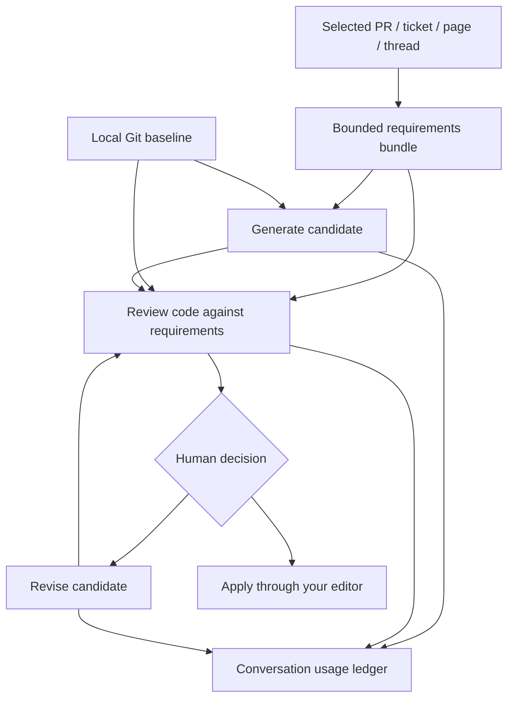

# v0.2 — Bitbucket, work context, code generation, and conversation cost

The agent is Git-host independent. Bitbucket repositories work with the original local Git
review commands. This release adds Bitbucket-specific PR metadata and requirements context,
candidate generation/revision, and local usage accounting. No GitHub dependency is involved.

## What is implemented

| Capability | v0.2 behavior | Boundary |
| --- | --- | --- |
| Bitbucket | Fetch selected PR metadata; pin local review to its source and destination commits | Local clone must already contain those commits; no automatic fetch/checkout |
| Jira | Read selected ticket description, summary, and optional acceptance-criteria custom fields | No ticket creation, transitions, or updates |
| Confluence | Read selected page text with page version and retrieval timestamp | No space crawling, child-page expansion, or editing |
| Slack | Read one selected thread page; export a review-summary draft | No Slack messages are posted |
| Code generation | Generate a full-file candidate restricted to selected paths | No working files are changed or executed |
| Candidate review | Review generated content against committed HEAD | Same evidence validation as normal reviews |
| Revision | Feed the exact candidate's latest review back into generation | Explicit command per iteration; no unlimited autonomous loop |
| Accounting | SQLite events grouped by conversation; observed usage and configured-rate estimates | Does not automatically observe every editor/chat model call |
| Cost controls | Compact prompts, exact-result cache, call limit, estimated-spend guard | Guard covers this agent's provider calls, not account-wide billing |

Cloud and Data Center adapters are supplied for Bitbucket, Jira, and Confluence. Select the
deployment in the integration config. Their response contracts are fixture-tested; your
organization's authentication, custom fields, API versions, VPN, and permissions need local verification.

## How the pieces connect



## 1. Try the extension without any external accounts

Create the demo repo using the README if you have not done so. From the project root:

```bash
python3 -m review_agent review --repo examples/demo-repo --provider demo \
  --work-context examples/work-context.demo.json \
  --conversation WEB-123 --usage-db /tmp/review-agent-demo.sqlite3 \
  --cache-seconds 600 --format json --output /tmp/demo-review-1.json

python3 -m review_agent review --repo examples/demo-repo --provider demo \
  --work-context examples/work-context.demo.json \
  --conversation WEB-123 --usage-db /tmp/review-agent-demo.sqlite3 \
  --cache-seconds 600 --format json --output /tmp/demo-review-2.json

python3 -m review_agent usage --conversation WEB-123 \
  --usage-db /tmp/review-agent-demo.sqlite3
```

The second review should show `cache.hit=true` while the code and requirements are unchanged.
The demo has zero remote model charges and makes no inference call. Use new output filenames
if you repeat these commands; outputs never overwrite existing files.

Show nonzero cost accounting using explicitly synthetic prices and usage:

```bash
python3 -m review_agent import-usage --input examples/usage.synthetic.json \
  --pricing examples/pricing.synthetic.toml --usage-db /tmp/review-agent-demo.sqlite3
python3 -m review_agent usage --conversation WEB-123 \
  --usage-db /tmp/review-agent-demo.sqlite3 --format json
```

The synthetic event estimates **USD 0.003**. This demonstrates the formula; it is not a
quoted provider price or your actual bill. Re-importing its same event ID is idempotent.

## 2. Configure your work tools

Copy `integrations/cloud.example.toml` or `integrations/data-center.example.toml` to a local
config outside the repository you will review. Fill in base URLs and workspace/project/repo.
The config names credential environment variables; it does not contain tokens.

| Product | Read credential setup |
| --- | --- |
| Bitbucket Cloud | API token + Atlassian email with `auth="basic"`, or an appropriate access/OAuth token with `auth="bearer"` |
| Bitbucket Data Center | Bearer personal access token where supported by your installation |
| Jira / Confluence Cloud | Email + API token for your own local script, or an existing appropriately scoped OAuth token |
| Jira / Confluence Data Center | Bearer token where supported; otherwise configure your installation's supported auth route |
| Slack | Token permitted to read the exact channel/thread; thread history permissions depend on token type and channel |

Use least-privilege read access for the selected resources. These connectors do not need write
scopes. For product distribution beyond your own internal local tooling, replace manual token
setup with your organization's approved OAuth/app authorization flow.

References: [Bitbucket API tokens](https://support.atlassian.com/bitbucket-cloud/docs/using-api-tokens/),
[Jira REST authentication](https://developer.atlassian.com/cloud/jira/platform/basic-auth-for-rest-apis/),
[Slack conversations.replies](https://docs.slack.dev/reference/methods/conversations.replies/).

For scoped Atlassian tokens or OAuth, your required API base may use the Atlassian API gateway
rather than the site domain. Set `base_url` to the API root required by that token and set
`web_url` to the normal browser site root. Include `/wiki` in the Confluence API root where
the selected route requires it. The adapter appends `/rest/api/3/...` for Jira Cloud,
`/rest/api/2/...` for Jira Data Center, `/api/v2/...` for Confluence Cloud, and
`/rest/api/content/...` for Confluence Data Center.

## 3. Fetch only the context for this piece of work

Replace the example IDs with resources you can access:

```bash
python3 -m review_agent work-context \
  --integrations /absolute/path/integrations.local.toml \
  --pr 123 --jira WEB-456 --confluence 987654 \
  --slack-channel C12345678 --slack-thread 1720000000.123456 \
  --output /absolute/path/work-context.local.json
```

Every selector is optional; choose at least one. Repeat `--jira` or `--confluence` for a few
relevant sources. There is no broad search of your workspace. All fetched descriptions and
messages remain untrusted model input. Integration HTTP failures return errors rather than
quietly becoming empty requirements.

Resource reads retain identifiers, links, versions when available, and retrieval times. Text
is capped at 6,000 characters per source. Slack reads a single page of up to 15 messages and
marks additional messages as omitted. It does not automatically paginate a rate-limited API.
See the [Bitbucket PR API](https://developer.atlassian.com/cloud/bitbucket/rest/api-group-pullrequests/),
[Confluence Cloud page API](https://developer.atlassian.com/cloud/confluence/rest/v2/api-group-page/), and
[Confluence Data Center examples](https://developer.atlassian.com/server/confluence/confluence-rest-api-examples/).

Review your local clone:

```bash
python3 -m review_agent review --repo /absolute/path/bitbucket-clone \
  --work-context /absolute/path/work-context.local.json \
  --conversation WEB-456 --provider ollama \
  --format json --output /absolute/path/review-WEB-456.json
```

When PR metadata is included, local HEAD must match the PR source commit and the destination
commit must exist locally. The review uses the merge-base-to-source committed diff. A different
HEAD fails explicitly. Fetch/check out the intended commit using your normal Git workflow;
this tool will not change your branch for you.

A context bundle is a retrieved snapshot. Rebuild it if the PR, ticket, page, or thread changes.
The code does not continuously recheck remote source freshness. Requirements omissions/truncation
are shown as incomplete. Exact finding locations still refer to changed code, not document lines.

## 4. Use the same context inside your editor

Set `work_context` and optionally `pricing_file`, `usage_db`, and cache settings in an explicit
review config. Supply that config to `scripts/editor_config.py --config /absolute/path/config.toml`
when generating the editor setup. No credentials are needed in the editor if you already fetched
the context bundle with the CLI and want the editor's existing model to review it.

Ask the editor:

> Use review-agent's get_review_context with conversation=WEB-456. Review the returned changes
> against the linked requirements. Validate your findings with validate_review. Then call
> get_cost_summary with conversation=WEB-456 and distinguish observed cost from unavailable
> editor usage. Do not modify or publish anything.

`get_cost_summary` is the fourth MCP tool. The local REST API also offers `POST /usage` with
`{"conversation":"WEB-456"}`. Servers are still pinned to one repository and operator config;
model tool arguments cannot change the provider or read arbitrary integration files.

## 5. Generate, review, and revise code

You can continue generating code in Cursor/Claude Code/Codex, then use ordinary `review` or
`run_review` on the generated changes. That works regardless of which tool created the code.

For independent generation through this agent, select a small task and exact allowed paths:

```bash
python3 -m review_agent generate --repo /absolute/path/your-repo \
  --task-file /absolute/path/task.md --path src/pricing.py --path tests/test_pricing.py \
  --provider ollama --conversation WEB-456 \
  --work-context /absolute/path/work-context.local.json \
  --output /absolute/path/proposal-v1.json

python3 -m review_agent review-candidate --repo /absolute/path/your-repo \
  --input /absolute/path/proposal-v1.json --provider ollama --conversation WEB-456 \
  --work-context /absolute/path/work-context.local.json \
  --format json --output /absolute/path/proposal-review-v1.json

python3 -m review_agent generate --repo /absolute/path/your-repo \
  --task-file /absolute/path/task.md --path src/pricing.py --path tests/test_pricing.py \
  --previous /absolute/path/proposal-v1.json --feedback /absolute/path/proposal-review-v1.json \
  --provider ollama --conversation WEB-456 \
  --work-context /absolute/path/work-context.local.json \
  --output /absolute/path/proposal-v2.json
```

The generator reads committed HEAD for those paths, not uncommitted work. It exports a JSON
proposal with full file contents and original file hashes. Existing files stay untouched.
New selected paths are allowed; symlinks, excluded files, traversal paths, and unselected files
are rejected. A reviewer can use a different provider/config for an independent second opinion.

Revision feedback must match the exact prior candidate and requirements snapshot. The workflow
keeps the latest candidate and feedback instead of replaying a growing chat transcript.
After inspecting a proposal, apply selected changes using your editor and run project tests.
This release does not include an automatic apply command or execute generated code.

The `demo` generator deliberately echoes unchanged baseline content. Use Ollama or a real API
to evaluate actual generation. The automated tests use synthetic generator responses to verify
path controls, review, revision, accounting, and repository preservation.

## 6. Track conversation cost correctly

Use the same `--conversation WEB-456` for related generation, review, and revision calls.
The CLI records usage by default at `~/.local/share/review-agent/usage.sqlite3`. Override it
with `--usage-db`, a config field, or `REVIEW_AGENT_USAGE_DB`. A conversation ID groups events;
it does not mean the application stores a full transcript or can read your editor's sessions.

```bash
python3 -m review_agent usage --conversation WEB-456
python3 -m review_agent usage --conversation WEB-456 --format json \
  --output /absolute/path/usage-WEB-456.json
```

The JSON includes per-event operation, provider/model, status, observed input/output/cache
tokens, latency, estimated cost, and the rate-card snapshot used. Unknown usage/rates are null,
never guessed as zero. Failed calls are retained; a malformed model answer can still cost money.

For OpenAI-style total-input usage:

`cost = (input - cached_input) × input_rate + cached_input × cached_rate + output × output_rate`

Divide by 1,000,000 when rates are per million tokens. Reasoning tokens reported within output
are not charged a second time. Anthropic's fresh input, cache reads, and cache writes are
normalized into total input, then charged with their corresponding rates and write lifetimes.
See [OpenAI prompt caching](https://developers.openai.com/api/docs/guides/prompt-caching) and
[Anthropic prompt caching](https://platform.claude.com/docs/en/build-with-claude/prompt-caching).

Populate `pricing.example.toml` using your exact model IDs and current account prices or
contract. Pass `--pricing /absolute/path/pricing.local.toml`. This release ships no assumed real
model price. Discounts, long-context tiers, regional rates, batch prices, non-token fees,
taxes, and invoice adjustments require your correct rate selection/reconciliation. Currency
is USD; INR conversion and subscription allocation are not silently estimated.

For actual local inference, pass `--local-inference` or set `billing_mode="local"` in the review
config. This explicitly records zero remote-model API cost while excluding electricity, hardware,
and editor subscriptions. Without that setting, localhost alone is not assumed free: a local
endpoint may proxy a paid cloud model. Metered calls require a matching rate card or show unknown
cost. Do not select local billing for a gateway that forwards to a paid upstream service.

## 7. Bring in editor usage where it is available

The MCP server sees tool requests, not all tokens in the host editor's conversation. It records
an unobservable editor handoff for context exports. Use a supported usage export from your
editor/provider, map it to the schema in `examples/usage.synthetic.json`, and import it.
Do not substitute a character count for measured tokens without labeling that estimate separately.

If the import accounts for a specific previously recorded handoff, put that handoff's event ID
in the file and use `--reconcile` so it replaces the unknown entry rather than double-counting:

```bash
python3 -m review_agent import-usage --input /absolute/path/actual-usage.json \
  --pricing /absolute/path/pricing.local.toml --reconcile
```

Standalone imports omit `--reconcile` and require a stable unique event ID. Reconciliation also
supports a failed agent call with supplied provider usage; its provider/model must match. Active
in-flight events cannot be reconciled. After a process crash they remain visibly unresolved;
the current version has no automated billing reconciliation service.

## 8. Reduce cost with controls you can measure

1. **Send less code:** review staged changes or a small committed PR. Exclude generated output,
   lockfiles, and unrelated files. Keep tests relevant to the change.
2. **Select requirements:** attach the actual Jira ticket and a few specification sections/pages;
   do not dump a whole Confluence space or Slack history into every request.
3. **Avoid duplicate prompt content:** the independent LLM prompt now sends each diff without the
   redundant internal old/new line maps. The validator retains those maps locally.
4. **Reuse identical results:** `--cache-seconds 600` enables exact review-result reuse. Code,
   requirements, prompt version, provider/model, endpoint, and output budget participate in the
   cache key. A hit makes no provider request and records zero new tokens/cost.
5. **Limit loops:** set `--max-calls 5 --max-usd 0.50` for a conversation after configuring rates.
   SQLite reservations account for concurrent in-flight calls. Unknown prior agent costs block
   the spend guard until reconciled. The preflight estimate is byte-based with envelope/output
   allowance: it is a conservative engineering guard, not a provider-enforced hard billing cap.
6. **Use the first review well:** start with your existing editor model or local Ollama, then use
   a stronger independent cloud reviewer for high-risk changes. Compare useful findings, missed
   defects, and latency before deciding a cheaper model is adequate.
7. **Inspect retries:** the agent does not automatically retry provider failures. The cost report
   highlights errors and large contexts so repeated failures can be fixed before another call.

No percentage savings is promised. Compare observed usage and known estimated spend for the
same task before and after each change; retain human-reviewed quality checks alongside cost.

## Storage and current limits

The ledger normally stores metadata and counts, not prompts, whole source files, or Slack
messages. If you enable review caching, validated reports and their evidence excerpts are
stored in the local SQLite file until cache cleanup; treat that file as sensitive. Exported
work-context/proposal/report files also contain work data and require your normal access controls.

This remains a local prototype. It has no multi-tenant RBAC, OAuth onboarding server, central
PII/DLP enforcement, provider invoice reconciliation, team dashboard, webhook listener,
automatic comment posting, or organization-wide editor interception. Those belong in the
shared-service phase after the first real workflows are evaluated.

## Validation

The release was tested with 72 automated cases, including synthetic Cloud/Data Center API
responses, real local Git changes, cost formulas, cache reuse/invalidation, concurrent budget
reservations, malformed-but-billable model output, generated candidates, exact revision
feedback, and preservation of repository files. The official MCP SDK interoperability check
also exercises the cost-summary tool. Live corporate integrations and real model quality
still require testing on your Mac with your approved accounts and network access.
